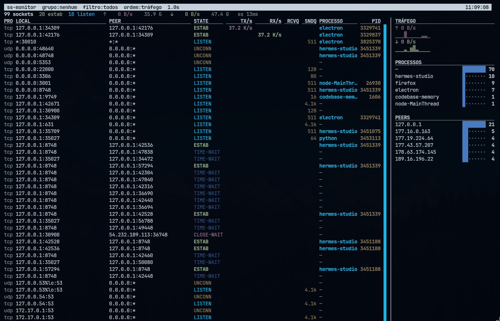

# network-monitor

A fast terminal network monitor for Linux, built around `ss` and `curses`.

`network-monitor` is meant for quickly seeing active sockets, traffic rates, listening services, processes, and PIDs in one terminal screen. It is especially useful when you want something lighter and more process-oriented than `iftop`.



## Features

- Live TCP/UDP socket table using `ss`
- Process and PID visibility for sockets available to the current user
- TX/s and RX/s rates derived from TCP socket counters (`ss -i`)
- Interface traffic summary from `/proc/net/dev`
- Filters for all sockets, established connections, and listeners
- Grouping by process, peer, or service
- Sorting by default order, traffic, queue, or process
- Responsive terminal layout with compact/minimal density modes
- Side panel with traffic sparklines, top processes, and top peers
- Non-blocking UI while socket collection runs in the background
- Test coverage with real `ss` output fixtures

## Screenshot


## Requirements

- Linux
- Python 3.11+
- `ss` from `iproute2`
- A terminal supported by Python `curses`

No root is required, but without root `ss -p` can only identify processes for sockets visible to your user. Run with `sudo` if you need process names/PIDs for all system sockets.

## Usage

```bash
python ./network-monitor.py
```

Options:

```bash
python ./network-monitor.py --interval 1.0
python ./network-monitor.py --iface eth0
python ./network-monitor.py --no-proc
python ./network-monitor.py --no-rates
python ./network-monitor.py --density 1
```

Full help:

```bash
python ./network-monitor.py --help
```

## Keyboard shortcuts

| Key | Action |
|---|---|
| `↑` / `↓`, `k` / `j` | Scroll one line |
| `PgUp` / `PgDn` | Scroll one page |
| `Home` / `End` | Jump to top/bottom |
| `g` | Cycle grouping: none/process/peer/service |
| `s` | Cycle filter: all/established/listen |
| `o` | Cycle sorting: default/traffic/queue/process |
| `i` | Toggle per-socket rate collection |
| `d` | Cycle density: normal/compact/minimal |
| `+` / `-` | Increase/decrease refresh interval |
| `p` | Pause/resume |
| `r` | Force refresh |
| `q` | Quit |

## Notes about traffic rates

Per-socket `TX/s` and `RX/s` come from TCP info counters exposed by `ss -i`, specifically the derivative of sent/received byte counters between refreshes.

That means:

- rates are TCP payload-oriented, not packet capture totals
- headers and non-TCP traffic are not represented per socket
- values will not exactly match tools such as `iftop`
- `ss -i` can be heavier on systems with many sockets; use `i` or `--no-rates` to disable it

The top summary also shows interface-level counters from `/proc/net/dev`. Use `--iface <name>` on hosts with bridges or virtualization to avoid counting the same traffic multiple times.

## Development

Create/use the local virtual environment and run tests:

```bash
/home/lucasjr/trabalho/network-monitor/.venv/bin/python -m pytest -q
/home/lucasjr/trabalho/network-monitor/.venv/bin/python -m py_compile network-monitor.py
python ./network-monitor.py --help
```

Current test coverage includes parsing, grouping, interface errors, `ss -p` fallback behavior, background fetch behavior, visual column priorities, and real `ss` fixtures.

## Project layout

```text
network-monitor.py              # single-file application
tests/test_network_monitor.py   # pytest suite
tests/fixtures/ss/              # real ss output fixtures
HERMES.md                       # local agent/project history
```

## License

MIT
